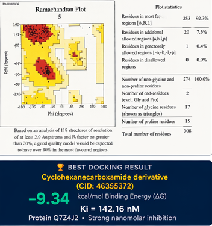

# 🧬 Protein Structure Modeling and Molecular Docking (GLT6D1)

## 🚀 Project Summary

✔ Built homology model of GLT6D1 protein using MODELLER  
✔ Performed molecular docking on 10 ligands using AutoDock  
✔ Best ligand achieved −9.34 kcal/mol binding energy (Ki = 142 nM)  
✔ Identified potential drug candidates for periodontitis treatment  

---

## 📌 Overview

This project performs an end-to-end computational drug discovery pipeline including homology modeling, validation, and ligand docking analysis for the GLT6D1 protein.

---

## 🏆 Key Result

Best ligand (CID: 46355372) showed strong binding:

- Binding Energy: −9.34 kcal/mol  
- Inhibition Constant (Ki): 142 nM  
- Key residues: TRP39 · LYS2 · GLU33 · ALA3  

---

## 🔄 Workflow Pipeline

1. Sequence Retrieval (NCBI)  
2. Template Search (BLAST → PDB)  
3. Homology Modeling (MODELLER)  
4. Model Validation (PROCHECK — Ramachandran Plot)  
5. Active Site Prediction (SCFBIO)  
6. Ligand Preparation (PubChem)  
7. Molecular Docking (AutoDock)  
8. Results Analysis (Binding Energy, Ki, Drug-likeness)  

---

## 🛠️ Tools & Technologies

- Python  
- MODELLER  
- AutoDock  
- PyMOL  
- BIOVIA Discovery Studio  
- NCBI BLAST  
- PubChem  
- SCFBIO  

---

## 📊 Results

- Built and validated high-quality homology model (>92% residues in favored regions)  
- Screened 10 ligands for binding affinity  
- Identified top candidates based on binding energy and Ki  

---

## 📸 Visualization

---

## 🧪 Conclusion

- Successfully constructed a reliable 3D model of GLT6D1  
- Identified strong ligand candidates for potential therapeutic use  
- Demonstrated effectiveness of computational drug discovery pipeline  

---

## 📚 References

- AutoDock documentation  
- MODELLER documentation  
- NCBI BLAST  
- PubChem database  

---

## 👩‍🔬 Author

**Zahera Fathima Khatoon**  
Roll No: 094224010028  
PG Diploma in Bioinformatics  
Osmania University, Hyderabad | 2021–2022

🔗 [LinkedIn](https://linkedin.com/in/zahera-khatoon-9598382a0) · [GitHub](https://github.com/zahera786)

---

## 📚 References

1. Lairson LL, Henrissat B, Davies GJ, Withers SG. Glycosyltransferases: structures, functions, and mechanisms. *Annu Rev Biochem.* 2008;77:521–555.
2. Krieger E, Nabuurs SB, Vriend G. Homology modeling. *Methods Biochem Anal.* 2003;44:509–24.
3. Morris GM et al. AutoDock4 and AutoDockTools4: Automated docking with selective receptor flexibility. *J Comput Chem.* 2009;30:2785–91.
4. Laskowski RA et al. PROCHECK — a program to check the stereochemical quality of protein structures. *J Appl Cryst.* 1993;26:283–291.

---

*Submitted for PG Diploma in Bioinformatics · PGRRCDE, Osmania University, Hyderabad · 2021–2022*  
*Supervised by Dr. Someswar R. Sagurthi*
